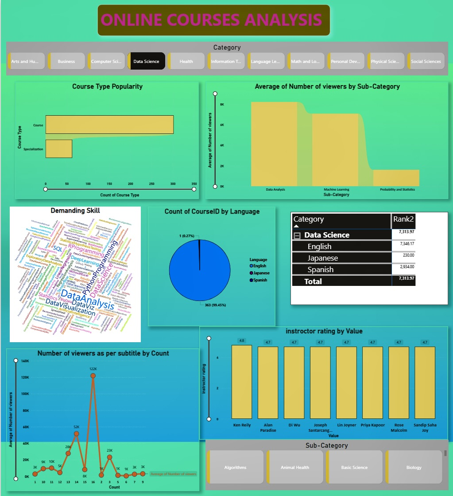

# 📚 Online Courses Analysis Dashboard
### Power BI | Data Analytics | Educational Trends

---

## 📸 Dashboard Preview

---

## 📌 Project Overview

This **Power BI Dashboard** analyzes online course data to uncover
trends in course popularity, viewer engageme
